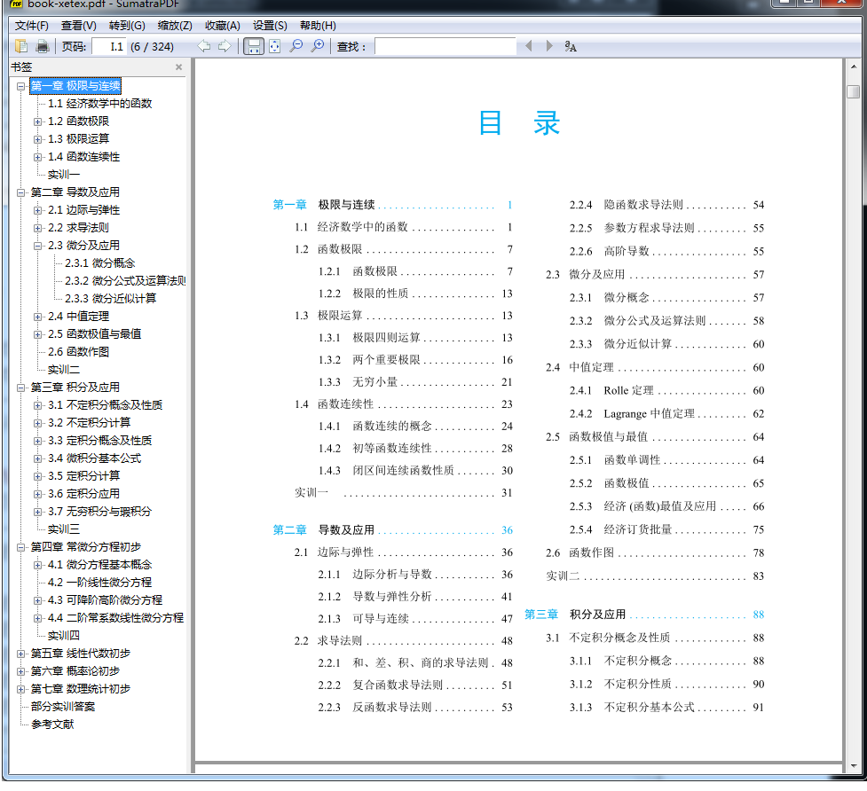
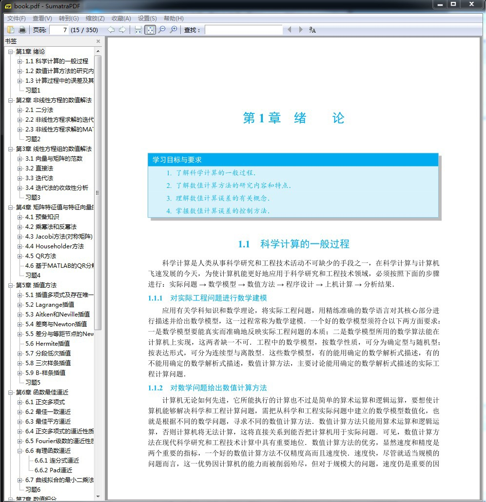
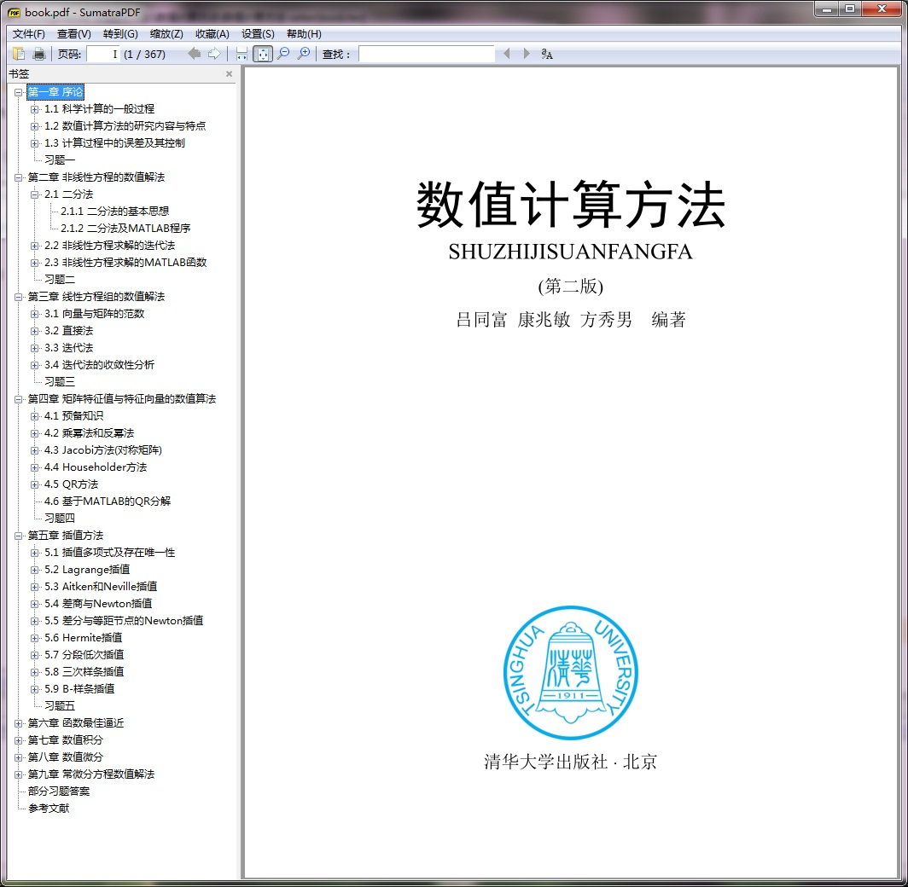
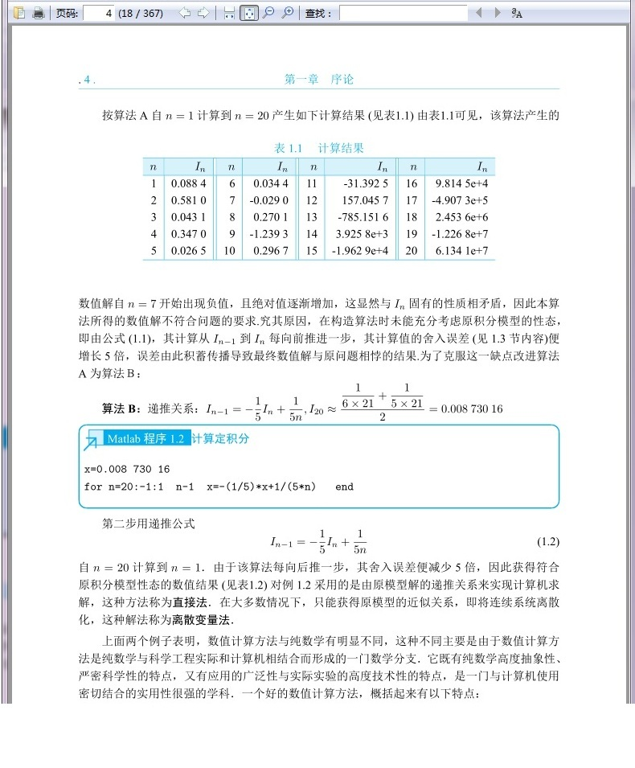
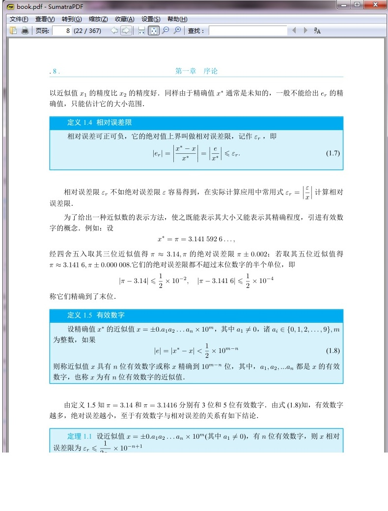
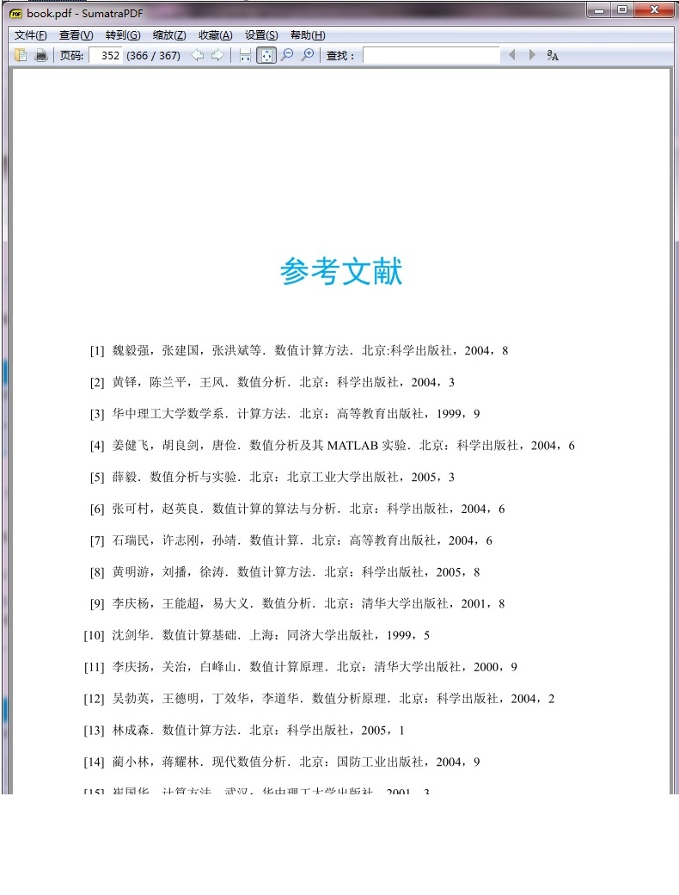
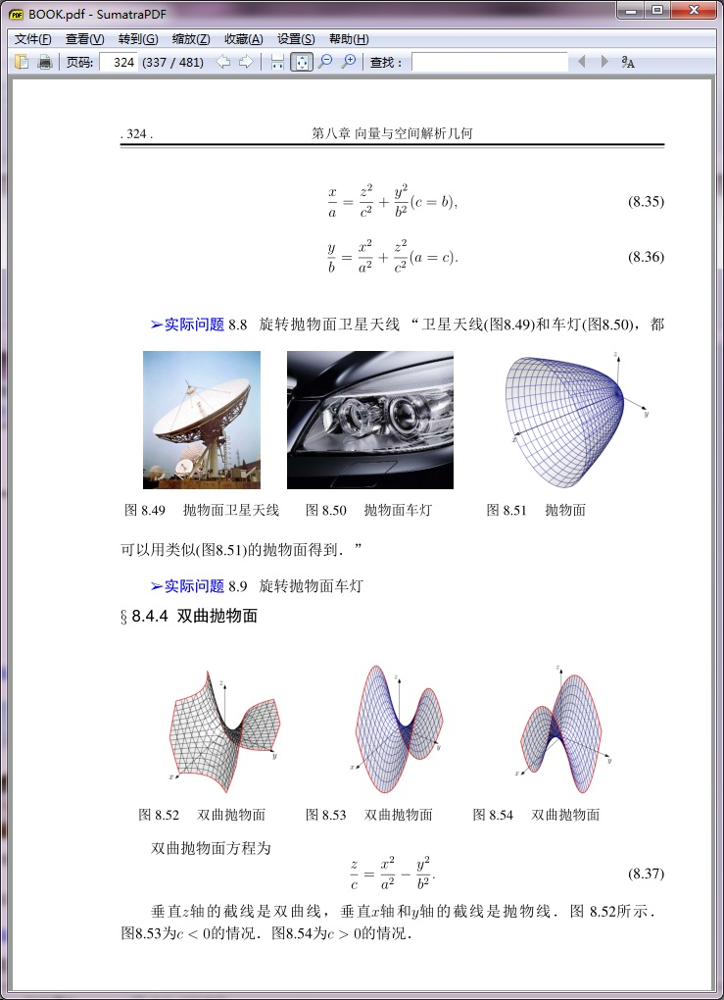
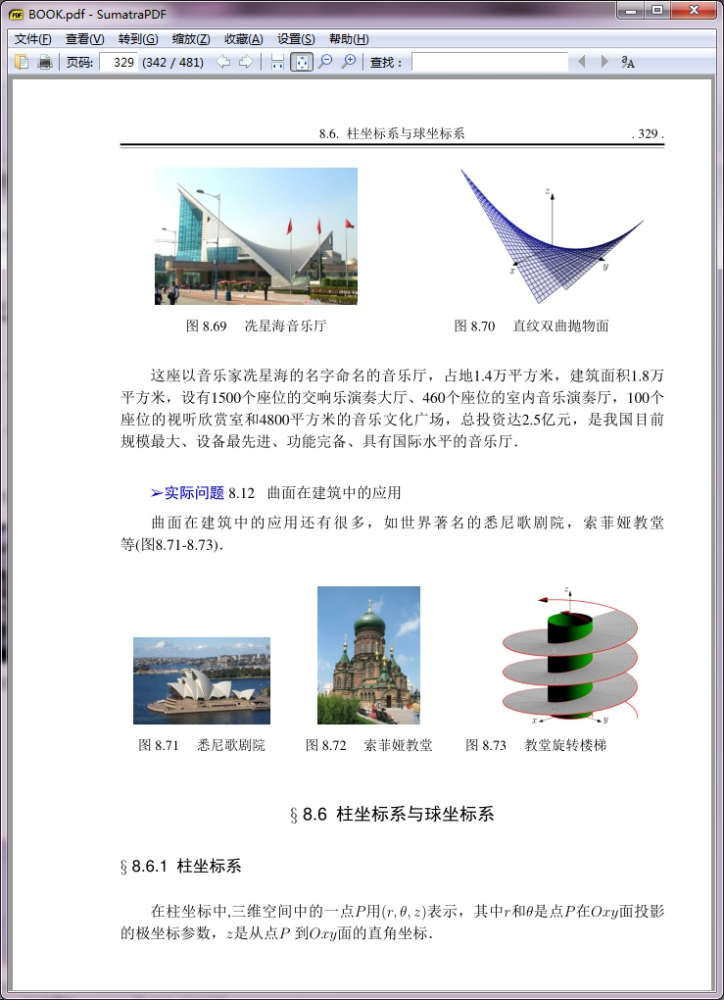
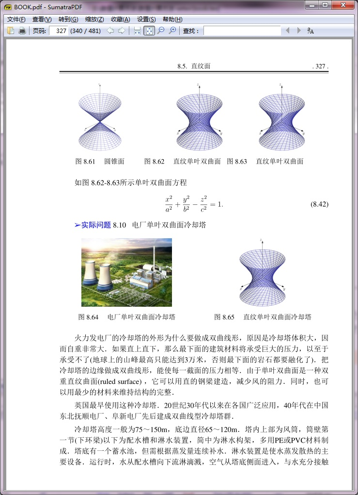

# latex-ltongfu

* [书籍模板-ctexbook-xtex-UTF-8](http://bbs.ctex.org/forum.php?mod=viewthread&tid=73184)

## Preview











## Content

> PDF文档发在爱问网上，tex模板在本论坛附件中，请登陆后下载。
>
> PDF《数值计算方法》（二版）（清华社）http://ishare.iask.sina.com.cn/f/25434091.html，http://ishare.iask.sina.com.cn/f/33431240.html
>
> PDF《高等数学及应用》（二版）（高教社）http://ishare.iask.sina.com.cn/f/25343501.html
>
> PDF《经济数学及应用》（人大社）http://ishare.iask.sina.com.cn/f/25341662.html
>
> 这些文档都是我的原创，出版时几乎没有改动，主要有两个，一是 LaTeX 书的模板，我想只有自己用 LaTeX 写了几本书后，才会有真正的体会，网上链接的那些老师的材料曾经对我都有过帮助……，还有电子讲义 beamer 的模板，我喜欢 Warsaw 主题样式……，书中插图主要使用 mathematica、matlab、maple、Asymptote 等完成，其中 Asymptote 在论坛上有个贴子：Latex+asymptote 如何画这个双曲抛物面: http://bbs.ctex.org/forum.php?mod=viewthread&tid=52188&extra=，记录了我学习的体会，供参考，由于附件太小，只能简化，图片自己找一下插上。
>
> book-xetex-UTF-8.rar (11.72 KB) 只能在texlive2012及以上版本用xelatex编译
>
> 数值计算方法-ctex2.9-book.rar (477.43 KB) 可以在ctex2.9下用PDFlatex编译
>
> book-xetex-UTF-8-参考文献 - 英文.rar (440.54 KB) 英文版（有多老师索要英文版，这次也共享了）只能在texlive2012及以上版本用xelatex编译


```
数值计算方法（二版）-latex文档相关说明
1．Latex文档编译环境Texlive2012。
2．用UTF-8编码格式打开/编辑/存储Latex文档。
3．用Texlive2012的xlatex编译主文件book.tex。
4．其他文件看主文件book.tex的相关注释即可明白。
%------------------------------------宏包，格式等-----------------------------------
\input{setup/package.tex}                   %引用宏包所在位置
\input{setup/format.tex}                    %格式所在位置
%------------------------------------------封面等-----------------------------------
\include{preface/cover}                         %封面
\include{preface/intro}                          %简介
\include{preface/intro2}                         %序
\include{preface/preface2}                       %二版前言
\include{preface/preface}                        %前言
%-----------------------------------------正文开始------------------------------
\include{book/chap1}                    %第一章
\include{book/chap2}                    %第二章
\include{book/chap3}                    %第三章
\include{book/chap4}                    %第四章
\include{book/chap5}                    %第五章
\include{book/chap6}                    %第六章
\include{book/chap7}                    %第七章
\include{book/chap8}                    %第八章
\include{book/chap9}                    %第九章
%-----------------------------------------正文结束------------------------------
\include{book/answer}                         %习题答案
\include{reference/references}                   %参考文献
5．注释掉文件：package.tex中的宏包：
\usepackage[CJKbookmarks, colorlinks,
bookmarksnumbered=true,
pdfstartview=FitH,
linkcolor=black]{hyperref}
去掉书签功能，可得到想要的印刷效果（目录章标题蓝色，有书签的结果是链接的黑色覆盖了目录章标题的部分蓝色，不好看）。
6． 去掉书签后，同时还要注释掉答案文件：answer .tex中第三行的命令：\phantomsection，不然会提示问号“？”。
7．现在的版式大小：
\usepackage[paperwidth=185mm,paperheight=230mm,textheight=190mm,textwidth=145mm,left=20mm,right=20mm, top=25mm, 
bottom=15mm]{geometry}            %定义版面
8．其他的看注释即可，如还有问题，可发 email:
ltongfu@126.com;       455699198@qq.com
```